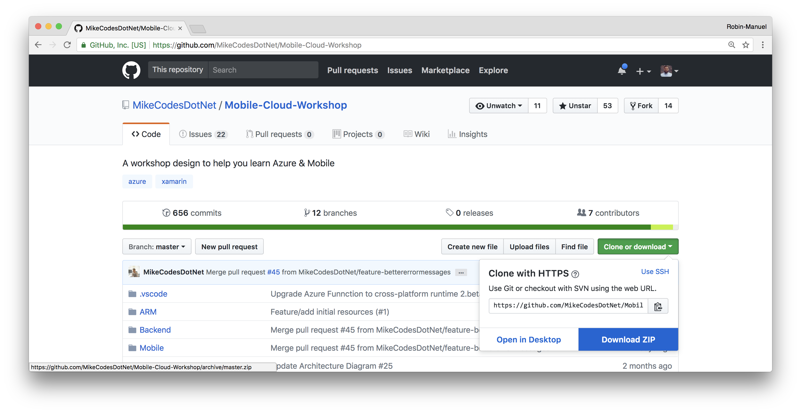
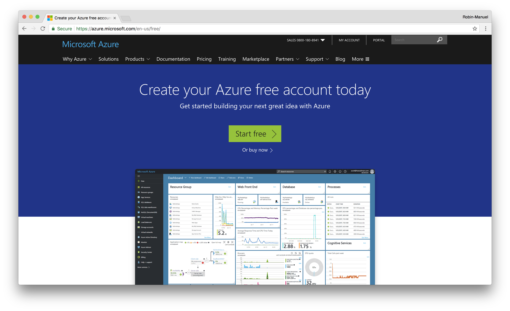
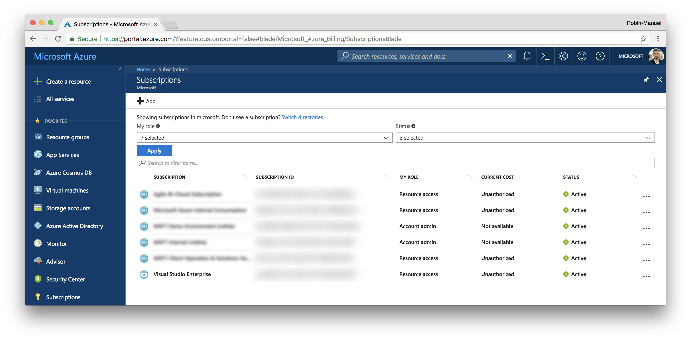
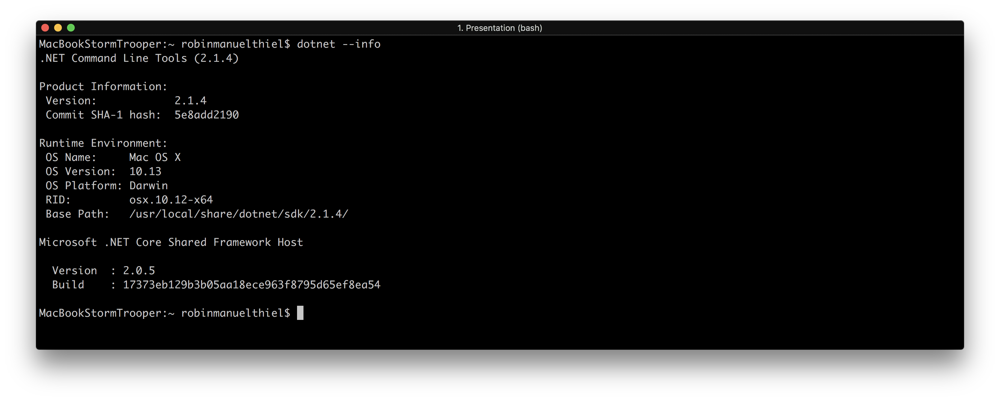
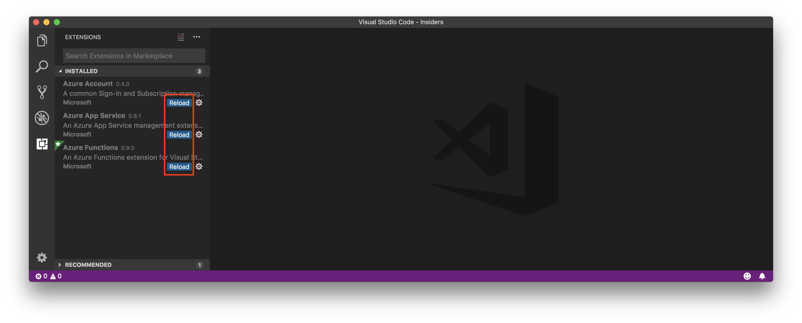
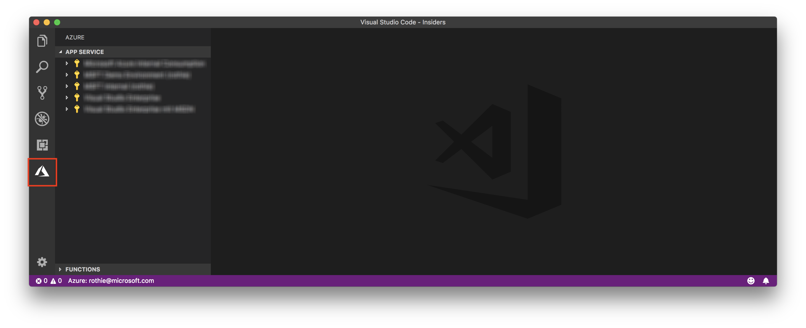
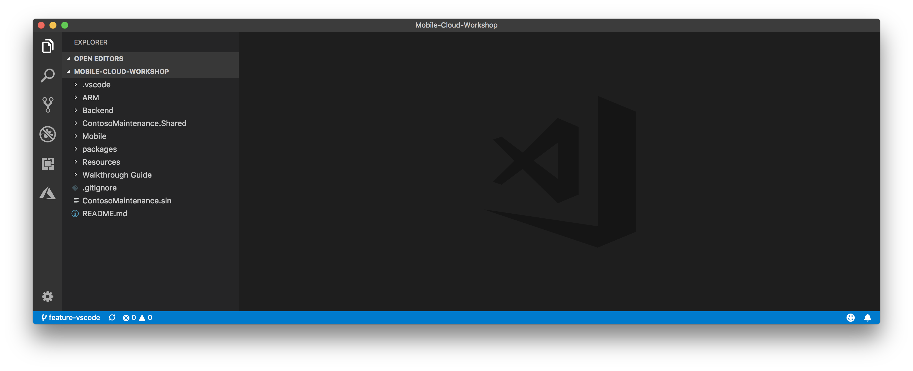

# Setting Up

> **Hint:** We highly recommend you setup and configure your system *before* attending the mobile workshop. Although we’ve allowed an hour in the morning to assist in troubleshooting configurations, we won’t have time to do a fresh installation.

## Prerequisites

Please bring your own **Windows or Mac** laptop. To participate in this workshop, some pre-work needs to be done. So please make sure you prepared your environment by setting up the following prerequisites:

### Mandatory
- [Microsoft Azure Account with a Subscription](https://aka.ms/azft-mobile)
- [Visual Studio Code](https://code.visualstudio.com/)
  - [Azure App Service Extension](https://marketplace.visualstudio.com/items?itemName=ms-azuretools.vscode-azureappservice)
  - [Azure Functions Extension](https://marketplace.visualstudio.com/items?itemName=ms-azuretools.vscode-azurefunctions)
- [Postman](https://www.getpostman.com/)

### Recommended
- [.NET Core 2.1 SDK](https://dotnet.microsoft.com/download) (choose x64 Installer on Windows)
- [Docker](https://www.docker.com/get-started)
- [Azure CLI 2.0](https://docs.microsoft.com/en-us/cli/azure/install-azure-cli?view=azure-cli-latest)
- [Terraform](https://www.terraform.io/intro/getting-started/install.html)


## Prepare your environment

### Download the workshop

You will need some of the contents of this workshop like the source code for the backend on your local machine. So it is a good idea to download the full repository as a ZIP file and extact it somewhere locally. You can easily do this by clicking the  ***Clone or download*** button on the start page and select ***Download ZIP***.



### Microsoft Azure

Creating a Microsoft Azure Account is easy! Just head over to the [Microsoft Azure for Mobile Landingpage](https://aka.ms/azft-mobile) and create a free Account. If you already have a Microsoft, Outlook, Office 365 or Active Directory Account from you company, you can re-use it.



Although the free Account includes a bunch of services that you can use, in this workshop we will work with advanced resources, which we need an Azure Subscription for. An Azure Subscriptuon is basically the way to pay for charged services and can be backed by a Credit Card or a company agreement.

You can check the Subscriptions for you account when visiting the [Azure Portal](https://portal.azure.com) and selecting ***Subscriptions*** from the side menu.



If no Subscriptions appear, visit the [Azure Subscription Portal](https://account.azure.com/Subscriptions) to add one.

## Test your configuration

### .NET Core

Most parts of this workshop are written in .NET Core 2.1 and we need to compile a few things from time to time. For this, we need to the [.NET Core SDK](https://www.microsoft.com/net/download/windows/build) installed. To check if the installation has been successful, open the *Terminal* or *Command Prompt* on your machine and type in

```bash
dotnet --info
```

If the command line answers you similar like shown in the screenshot below, your machine can now run and compile .NET code.



### Visual Studio Code

Open Visual Studio Code and navigate to the ***Extensions*** tab on the left (or select ***View -> Extensions*** from the menu) and make sure that you installed the **Azure App Service** and **Azure Functions**  extensions at least. If you don't have them installed, you can search for them in the Extensions tab.

Note, that you need to ***Reload*** Visual Studio Code after installing extensions!



Once the extensions has been installed successful and Visual Studio Code has been reloaded, you should see a new ***Azure*** tab on the side. Select it and make sure that you are logged in with you Azure account. Please verify, that you see at least one of your subscriptions here.



Now you are good to go! Open the recently downloaded and unzipped Workshop folder in Visual Studio Code by clicking ***File -> Open...*** in the menu and select the full folder. The result should look similar to this:

