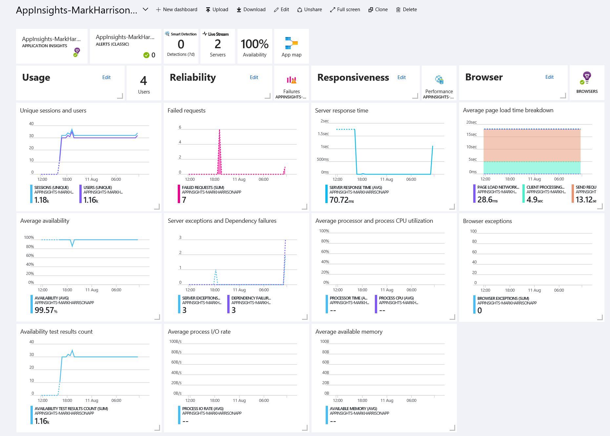

# Application Insights - Hands-on Lab Script - part 1

Mark Harrison : 6 Aug 2018

Michelle Azzopardi : 19th June 2019 - updated

- [Part 1 - Create AppInsights instance](appinsights-1.md) ... this document
- [Part 2 - Develop and deploy AppInsights enabled webapp](appinsights-2.md)
- [Part 3 - Get insights on application](appinsights-3.md)
- [Part 4 - Advanced Analytics](appinsights-4.md)  
- [Part 5 - Availability Monitoring](appinsights-5.md)
- [Part 6 - Usage Behaviour Analysis](appinsights-6.md)

## Create AppInsights instance

### Overview

Application Insights is an extensible Application Performance Management (APM) service for web developers on multiple platforms. Use it to monitor your live web application. It will automatically detect performance anomalies. It includes powerful analytics tools to help you diagnose issues and to understand what users actually do with your app. It's designed to help you continuously improve performance and usability. It works for apps on a wide variety of platforms including .NET, Node.js and Java EE, hosted on-premises, hybrid, or any public cloud. It integrates with your DevOps process, and has connection points to a variety of development tools. It can monitor and analyze telemetry from mobile apps by integrating with Visual Studio App Center.

### How does Application Insights work?
You install a small instrumentation package in your application, and set up an Application Insights resource in the Microsoft Azure portal. The instrumentation monitors your app and sends telemetry data to the portal. (The application can run anywhere - it doesn't have to be hosted in Azure.)

You can instrument not only the web service application, but also any background components, and the JavaScript in the web pages themselves.

In addition, you can pull in telemetry from the host environments such as performance counters, Azure diagnostics, or Docker logs. You can also set up web tests that periodically send synthetic requests to your web service.

All these telemetry streams are integrated in the Azure portal, where you can apply powerful analytic and search tools to the raw data.

#### What's the overhead?
The impact on your app's performance is very small. Tracking calls are non-blocking, and are batched and sent in a separate thread.

## What does Application Insights monitor?
Application Insights is aimed at the development team, to help you understand how your app is performing and how it's being used. It monitors:

- Request rates, response times, and failure rates - Find out which pages are most popular, at what times of day, and where your users are. See which pages perform best. If your response times and failure rates go high when there are more requests, then perhaps you have a resourcing problem.
- Dependency rates, response times, and failure rates - Find out whether external services are slowing you down.
- Exceptions - Analyze the aggregated statistics, or pick specific instances and drill into the stack trace and related requests. Both server and browser exceptions are reported.
- Page views and load performance - reported by your users' browsers.
- AJAX calls from web pages - rates, response times, and failure rates.
User and session counts.
- Performance counters from your Windows or Linux server machines, such as CPU, memory, and network usage.
- Host diagnostics from Docker or Azure.
- Diagnostic trace logs from your app - so that you can correlate trace events with requests.
- Custom events and metrics that you write yourself in the client or server code, to track business events such as items sold or games won.

### Create AppInsights resource

This must be done via the management portal.

- Select the WebApp just created
- Select the Application Insights menu item

- Select the 'Setup Application Insights' link

In the configuration specify:

- Create New Resource ... give it a name of choice
- Specify runtime ... ASP.NET Core
- Code Level Diagnostics ... On
- profile ... On
- Snapshot debugger ... On

 Once instantiated, a confirmation will be displayed.  Click on the link to view the Application Insights.

- Select `Application Dashboard` to get an overview dashboard

---
[Home](appinsights-0.md) | [Next](appinsights-2.md)

---
### [Next Step: App Service Plans - API and Web Apps](.././04%20Web%20API)

