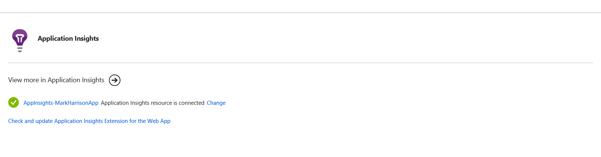

# Application Insights - Hands-on Lab Script - part 1

Mark Harrison : 6 Aug 2018
Michelle Azzopardi : 19th June 2019 - updated

- [Part 1 - Create AppInsights instance](appinsights-1.md) ... this document
- [Part 2 - Develop and deploy AppInsights enabled webapp](appinsights-2.md)
- [Part 3 - Get insights on application](appinsights-3.md)
- [Part 4 - Advanced Analytics](appinsights-4.md)  
- [Part 5 - Availability Monitoring](appinsights-5.md)
- [Part 6 - Usage Behaviour Analysis](appinsights-6.md)

## Create AppInsights instance

### Overview

Application Insights is an extensible Application Performance Management (APM) service for web developers on multiple platforms. Use it to monitor your live web application. It will automatically detect performance anomalies. It includes powerful analytics tools to help you diagnose issues and to understand what users actually do with your app. It's designed to help you continuously improve performance and usability. It works for apps on a wide variety of platforms including .NET, Node.js and Java EE, hosted on-premises, hybrid, or any public cloud. It integrates with your DevOps process, and has connection points to a variety of development tools. It can monitor and analyze telemetry from mobile apps by integrating with Visual Studio App Center.

### How does Application Insights work?
You install a small instrumentation package in your application, and set up an Application Insights resource in the Microsoft Azure portal. The instrumentation monitors your app and sends telemetry data to the portal. (The application can run anywhere - it doesn't have to be hosted in Azure.)

You can instrument not only the web service application, but also any background components, and the JavaScript in the web pages themselves.

### Create AppInsights resource

This must be done via the management portal.

- Select the WebApp just created
- Select the Application Insights menu item

- Select the 'Setup Application Insights' link

In the configuration specify:

- Create New Resource ... give it a name of choice
- Specify runtime ... ASP.NET Core
- Code Level Diagnostics ... On
- profile ... On
- Snapshot debugger ... On

 Once instantiated, a confirmation will be displayed.  Click on the link to view the Application Insights.

- Select `Application Dashboard` to get an overview dashboard

---
[Home](appinsights-0.md) | [Next](appinsights-2.md)

---
# Next Steps 
[Web API](../04%20Web%20API/README.md)

