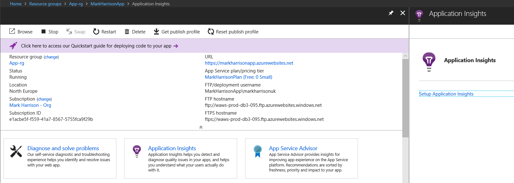
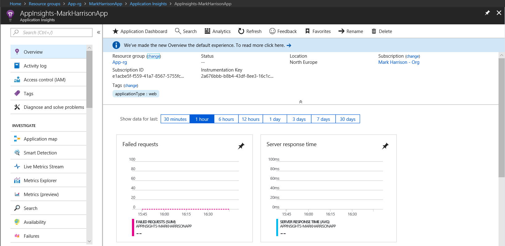

# Application Insights - Hands-on Lab Script - part 1

Mark Harrison : 6 Aug 2018


- [Part 1 - Create AppInsights instance](appinsights-1.md) ... this document
- [Part 2 - Develop and deploy AppInsights enabled webapp](appinsights-2.md)
- [Part 3 - Get insights on application](appinsights-3.md)
- [Part 4 - Advanced Analytics](appinsights-4.md)  
- [Part 5 - Availability Monitoring](appinsights-5.md)
- [Part 6 - Usage Behaviour Analysis](appinsights-6.md)

## Create AppInsights instance

### Overview

Application Insights is an extensible Application Performance Management (APM) service for web developers on multiple platforms. Use it to monitor your live web application. It will automatically detect performance anomalies. It includes powerful analytics tools to help  diagnose issues and to understand what users actually do with an app. It's designed to help continuously improve performance and usability.

### Create Resource Group

All Azure resources must reside with an Azure resource group.

- Invoke the following:
  - Amend the resource group name to that required - and in the subsequent instructions
  - Amend the location to that require

```text

az group create --name App-rg --location northeurope
az configure --defaults group=App-rg

```

### Create WebApp resource

- Invoke the following
  - Amend the WebApp name and plan to that required.

```text
$webappname = "MarkHarrisonApp"
$planname = "MarkHarrisonPlan"

az appservice plan create --name $planname  --sku F1
az webapp create --name $webappname  --plan $planname
```

### Create AppInsights resource

This must be done via the management portal.

- Select the WebApp just created
- Select the Application Insights menu item



- Select the 'Setup Application Insights' link

In the configuration specify:

- Create New Resource ... give it a name of choice
- Specify runtime ... ASP.NET Core
- Code Level Diagnostics ... On
- profile ... On
- Snapshot debugger ... On


 Once instantiated, a confirmation will be displayed.  Click on the link to view the Application Insights.




- Select `Application Dashboard` to get an overview dashboard


---
[Home](appinsights-0.md) | [Next](appinsights-2.md)

---
# Next Steps 
[Web API](../04%20Web%20API/README.md)

