# App Service

Azure App Service is Microsoft’s highly scalable, self-patching platform for hosting web, mobile and API apps built using .NET, Java, Ruby, Node.js, PHP, and Python or Docker containers.

App Service is fully managed and allows us to set the maximum number of instances on which we want to run our backend app on. Microsoft will then manage the scaling and load balancing across multiple instances to ensure your app perform well under heavy load. Microsoft manages the underlying compute infrastructure required to run our code, as well as patching and updating the OS and Frameworks when required.

## 1. Create a new App Service (Web App)

Web Apps are one of the App Services, that we can deploy to Azure. They can be configured easily at the [Azure Portal](https://portal.azure.com). You can find them, by clicking the ***Create a resource*** button at the top-left corner and selecting the ***Web*** category.

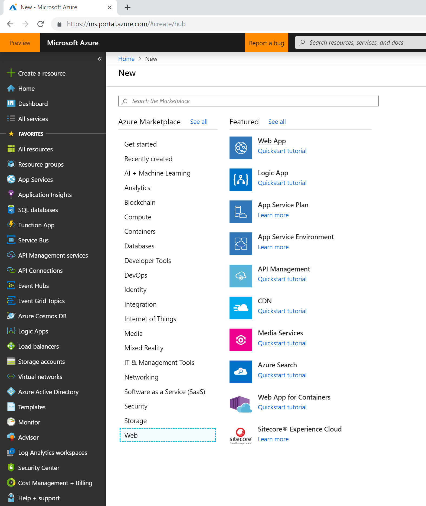

### 1.1 Configure your App Service

As you can see in the configuration blade, we have to configure a few things, before creating a new App Service, as App Name, Subscription, Resource Group, OS and App Service Plan / Location. Let's go through all of them in detail quickly, to understand, what we are configuring here.

#### App name

This is the name of your application and as you can see, the name will resolve into an web address like `yourname.azurewebsites.net`. After creation of your App Service, it weill be publically available at this address. Of course, you can also assign a custom domain to it later.

#### Subscription

By the end of the day, someone has to pay for all these services, that we are provisioning. Behind every Azure Subscription is a payment model that takes care of our cost. One Azure Account can have multiple Subscriptions.

#### Resource Group

We have learned about the concept of Resource Groups earlier in this module. During the creation process of every Azure Resource, we can select a Resource Group, to assign it to.

#### OS

App Services, can be based on Windows, Linux or Docker as their core technology. This becomes important, when taking a look at the programming framework, that we are using for the application's logic itself. While .NET Framework for example only runs on Windows, Node.js is more performant on a Linux host. If we want to provide a Docker container instead of deploying our application directly to the App Service, we can do that as well.

> **Hint:** At this workshop, the Backend API Logic is written with .NET Core, which runs cross-platform. So you can choose both, Windows and Linux. We also provide it as a Docker image, so you can also choose Docker as the operation system of your App Service. Just choose, whatever you are most interested in!

#### App Service Plan

An App Service, is just the logical instance of an application, so it has to run within an **App Service Plan**, which is provides the actual hardware for it. You can run multiple App Services within the same App Service Plan, if you want to, but be aware, that they share the App Service Plan's Resources then. We will create an App Service Plan step by step in the following sections of this module.

### 1.2 Create an App Service Plan

In App Service, an app runs in an App Service plan. The App Service plan defines a set of compute resources for a web app to run. These compute resources are analogous to the server farm in conventional web hosting. One or more apps can be configured to run on the same computing resources (or in the same App Service plan). When you create an App Service plan in a certain region (for example, West Europe), a set of compute resources is created for that plan in that region. Whatever apps you put into this App Service plan run on these compute resources as defined by your App Service plan.

A new App Service Plan for our Web App,  is automatically generated in the ***App Service Plan*** field in the Web App Create wizard **AFTER YOU HAVE SELECTED A REGION** and the App Service Plan is created in the same region as your webapp or you can completely rename your App Service Plan and hit the ***Create new*** button.

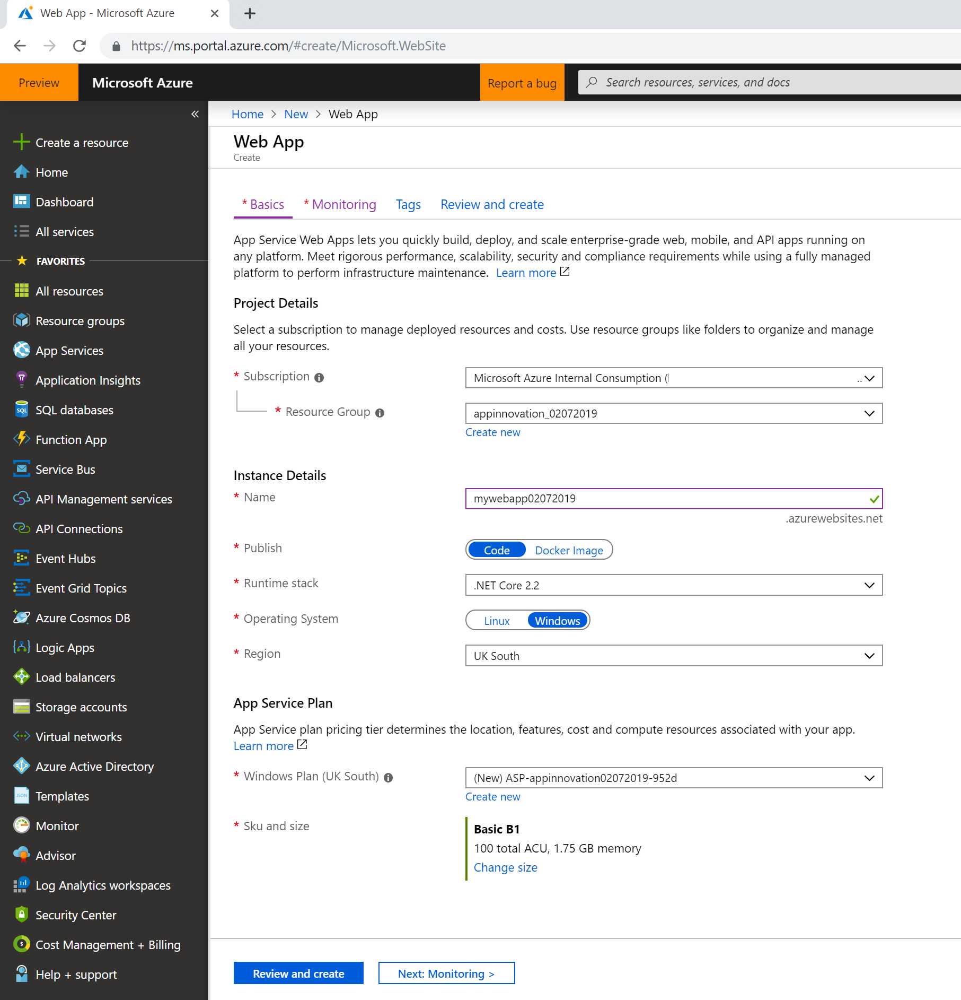

Fill in the following values:

- **App Service plan:** `myawesomestartupplan` (or similar)
- **SKU and size:** B1

Creating an App Service Plan is easy, but we have to consider where our users are? We want our services to be running as close to our users as possible as this dramatically increases performance. We also need to consider how much Compute resources we think we'll need to meet demand.

Clicking ***Sku and size***, shows all the different options we have (it's a lot!). I won't list what their differences are as their listed in the portal, but keep it mind, with the cloud we don't need to default to over-provisioning. We can scale up later if we have to! For this workshop, a B1 Basic site will be more than enough to run this project. More complex development projects should use something in the Standard range of pricing plans. Production apps should be set up in Standard or Premium pricing plans.  Click ***Apply*** after you have selected the right plan.


The Sku and size tier and with it the size of your App Service can be changed later, when you need to scale-up the service. 

After you configured everything, the App Service Plan configuration should now look like this:

- **Subscription:**  Select the right subscription you will deploy your web app to
- **Resource group:** *choose the one you created earlier*
- **App name:** `myawesomestartupapi` (or similar)
- **Publish:** Code / Docker Image
- **Runtime stack:** Choose the correct version for your runtime stack
- **Operating System:** Windows / Linux
- **App Service plan:** *choose the right plan as shown earlier*
- **Sku and size:** choose the Basic B1 sku under the Dev/Test Tier

We are not done yet.  Once you have configured your app service plan, click ***Next Monitoring***.  Choose the automatically generated App Insights, or create new to select a different region.  Click on ***Next Tags*** once done. 

- **Enable Application Insights:** Yes
- **Application Insights Location:** *choose the closest one, or same region if you decided to create a new one*

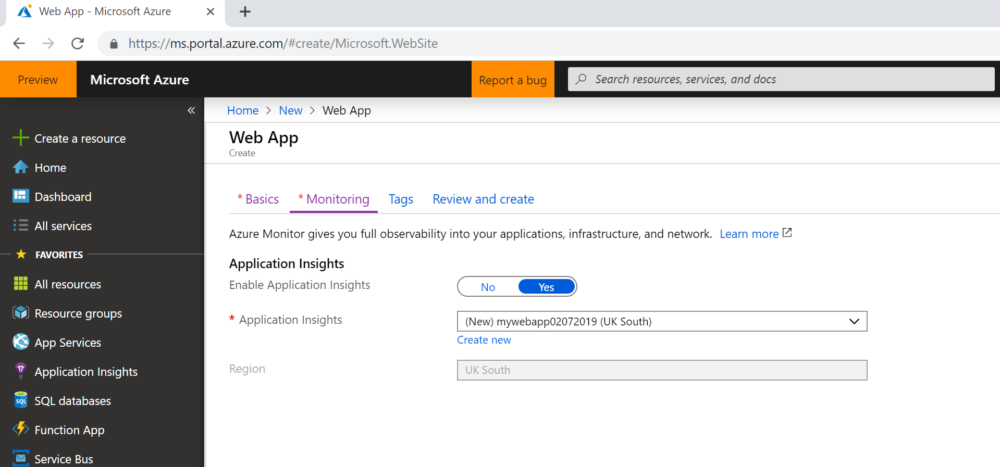

You apply tags to your Azure resources giving metadata to logically organize them into a taxonomy. Each tag consists of a name and a value pair. For example, you can apply the name "Environment" and the value "Production" to all the resources in production.

After you apply tags, you can retrieve all the resources in your subscription with that tag name and value. Tags enable you to retrieve related resources from different resource groups. This approach is helpful when you need to organize resources for billing or management.


With all the configuration options set, hit "Review and Create" and review all the configuration settings for your webapp.  If you are happy hit "Review and Create" and hold tight. 
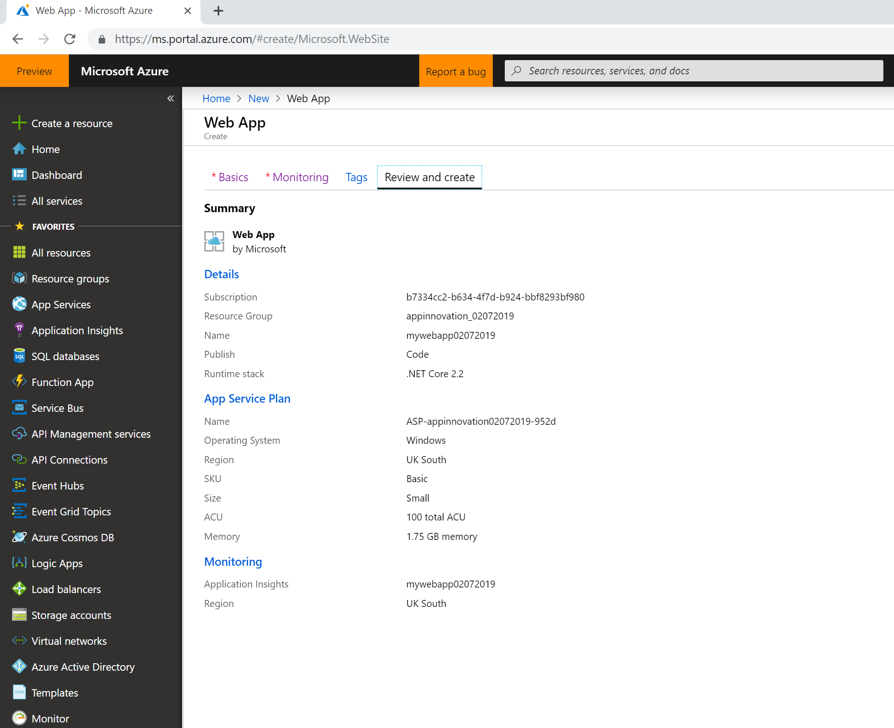

Once the deployment has finished, we should be able to navigate to our app through the browser and see a generic Azure landing page. The deployment of the new service can take a few minutes, but you can watch its progress in the "Bell" notification area in the toolbar. 

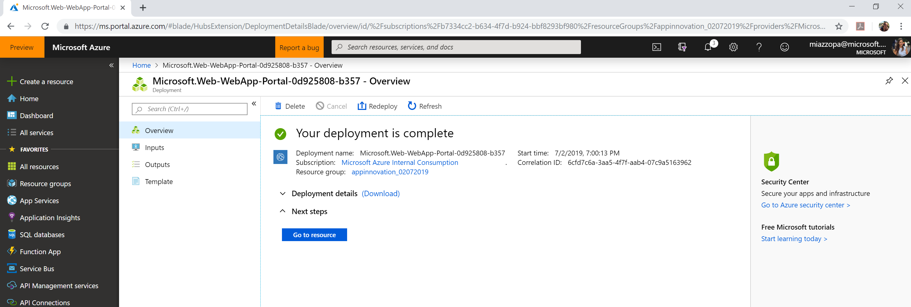

Because my app name was: "myawesomestartupapi", the unique URL would be: `https://myawesomestartupapi.azurewebsites.net`. You should see something similar to the image below, when browsing it.

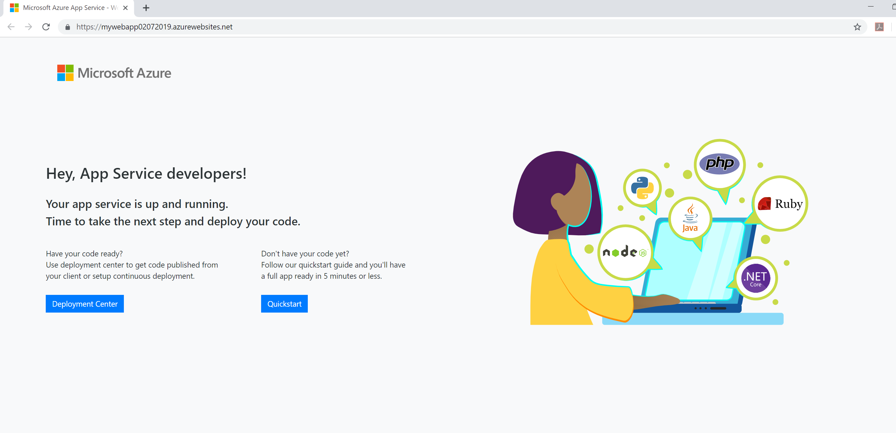

## 2. Deploy your apps to App Service

Azure App Service has many options for how to deploy our code. These include continuous integration, which can link to Visual Studio Team Services or GitHub. We could also use FTP to upload the project, but we're not animals, so we won't.

The good news is: The full ASP.NET Core WebAPI code for the backend logic is already written for us and is located in the `Backend/Monolithic` folder of the workshop. But before we can upload it to the cloud, we need to **compile** it.

We can also create a Docker image for it or use the pre-built images, that can find on Docker Hub. Just as we discussed in the [previous module](../)!

<details><summary>Build and deploy a code package</summary><p>

#### Compiling the code by yourself

We quickly have to dive into the .NET Developer's world! For this, right-click the `Monolithic` folder in Visual Studio Code and select ***Open in Terminal / Command Line***. The Terminal window in Visual Studio Code pops up and we can enter the command to compile the application.

```bash
dotnet build
```

The output should look like this and we should see the **Build succeeded** message.

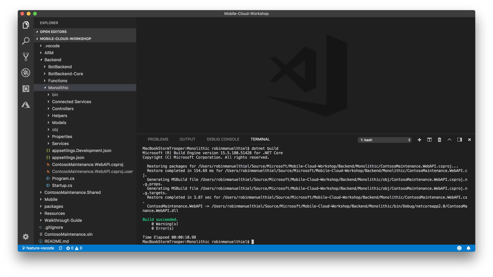

Building (compiling) the code generated two more folders for us: `/bin` and `/obj`. Here we can find executable files that we can upload to the web. As an ASP.NET Core project does not only consist of .NET code, but also contains some HTML, CSS and JavaScript, we need to bundle all the files together. So let's run another command.

```bash
dotnet publish
```

Once this command ran successfully, we have everything we need. Inside our `Monolithic` folder, we should now find a `bin/Debug/netcoreapp2.0/publish` folder that contains our ready-to-run backend logic. Now you can simply right-click this `publish` folder and select ***Deploy to Web App***.

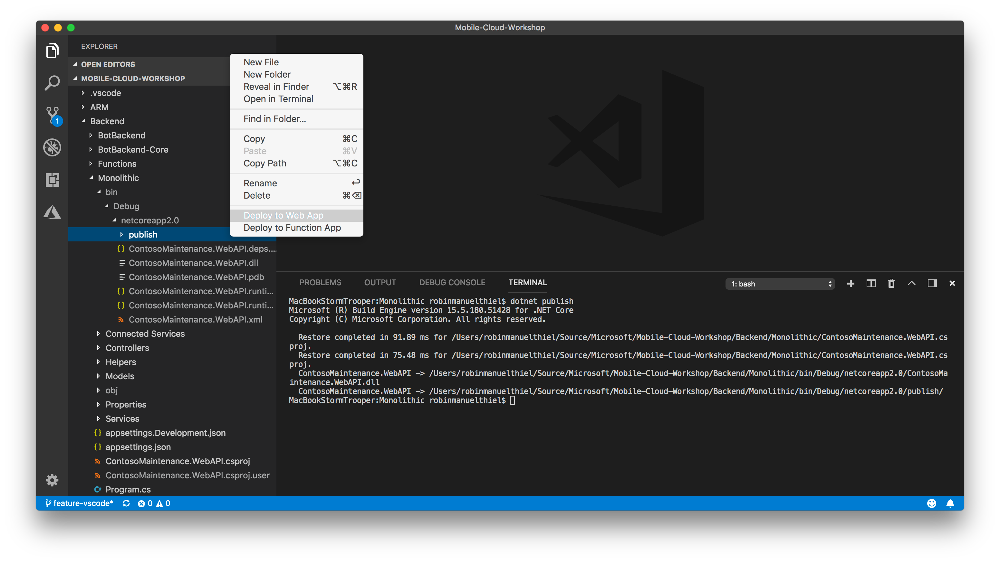

Follow the process of selecting a Subscription and Web App to publish to, confirm the publish process and enjoy your Web API.

</p></details>

or

<details><summary>Deploy a Docker container</summary><p>

#### Create and use a Docker image

Open the [Azure Portal](https://portal.azure.com) and navigate to your Docker based App Service, that you have created earlier. When you scroll down to the ***Container Settings*** on the left side, you can find a configuration for image sources (like Azure Container Registry or Docker Hub).

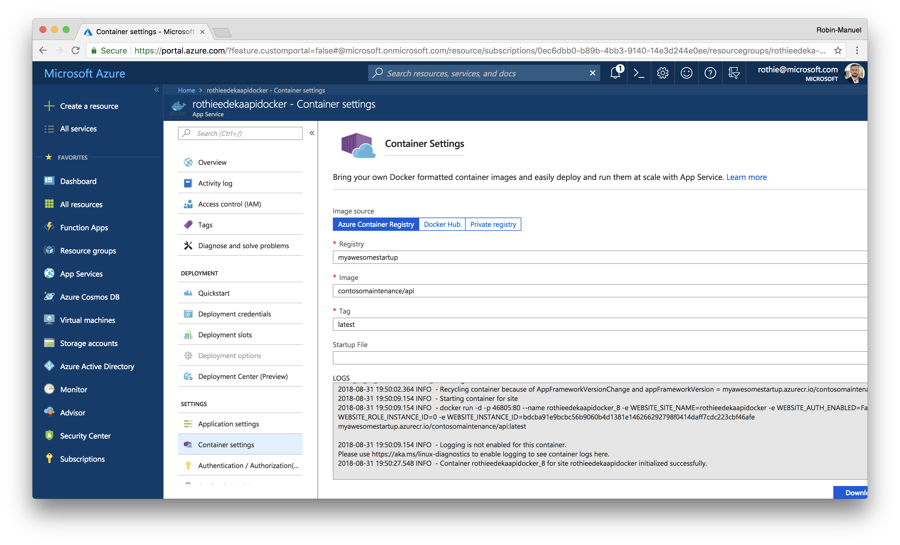

Here we can connect to our Container Registry. Select our container and ***Save*** the settings. If you have created your own Azure Container Registry, use that one here. Otherwise, you can use the images from Docker Hub.

> **Hint:** You can enable ***Continuous Deployment*** at the bottom of the Container Settings, to update the application automatically, when a new version of your container gets pushed to the Container Registry.

</p></details>

### 2.2 Verify, your app is running

After a few seconds, after refreshing the browser, your Web App should display the published code and look like this:

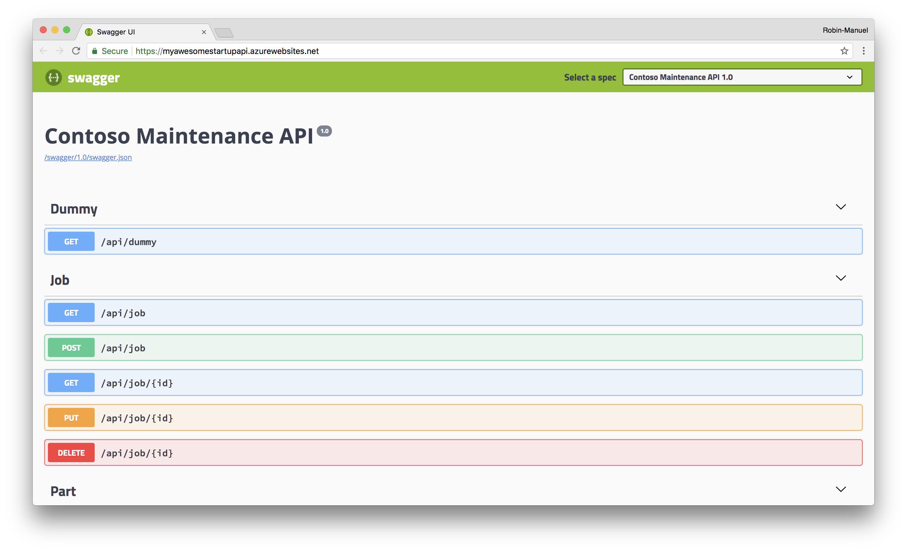

To test if the deployment is work and the app is accepting HTTP requests correctly, let's go ahead and navigate to the **/api/ping** endpoint. In my case, I'll use the following URL: `http://myawesomestartupapi.azurewebsites.net/api/ping`.


This shows that the backend is responding as expected! Before we move onto deploying storage services, you might want to read some tips and tricks for running App Services like a pro.

## Use Secrets

Throughout the workshop we will create more and more services and need to connect them with each other. This will be mostly done by placing the services connection information (e.g. Connection Strings) in a securely stored but for the service accessible place. The demo application from this workshop depends on them to connect with the database, blob storage and so on.

For Azure App Services, those secrets are placed securely and encrypted in the **Application Settings**.

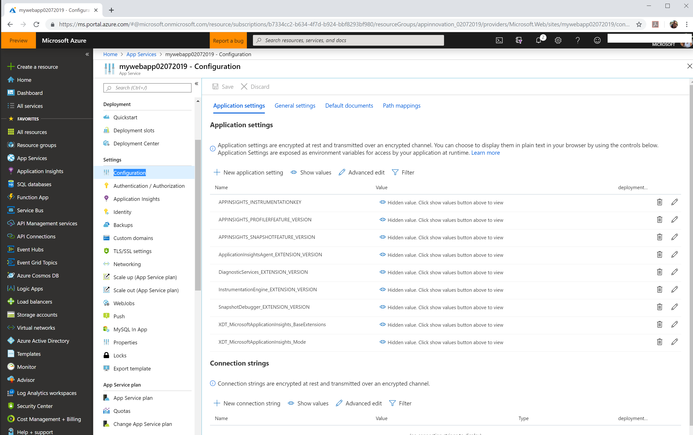

Navigate to the Web API App Service in the Azure Portal and open the ***Application settings*** from the menu on the left. Scroll down to the ***Application settings*** section and you will see a table where we can add settings to.

Add the settings in the format `Settings__Key` (two underscores) and take the values from the ***Keys*** section of your services. Hit ***Save*** at the top of the page once you are set.

## Additional Resouces

- [Azure App Services Tips and Tricks](TIPS-AND-TRICKS.md)

&nbsp;

---
# Next Steps 
[Monitoring](.././04%20Monitoring%20PaaS)
---

&nbsp;
