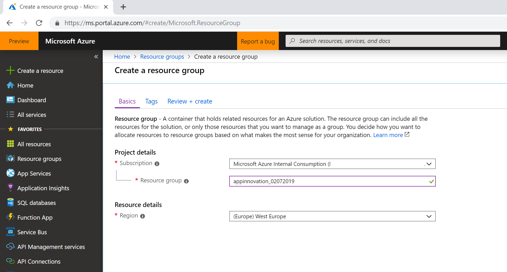
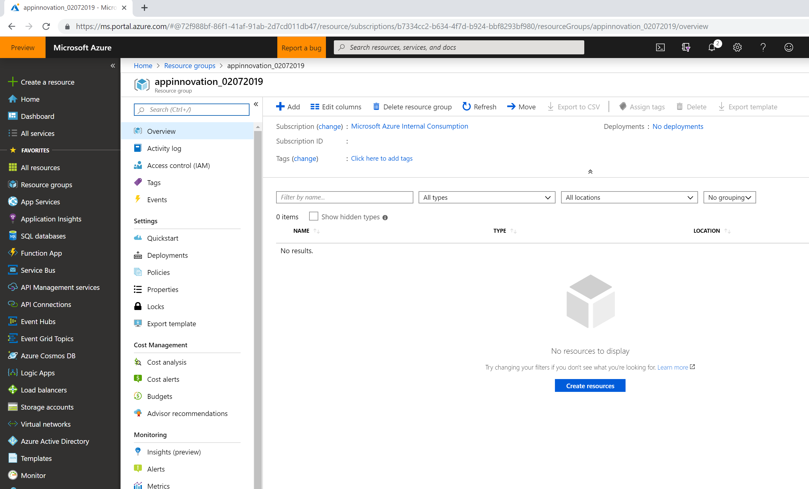

# App Service

Azure App Service enables you to build and host web apps, mobile back ends, and RESTful APIs in the programming language of your choice (.NET, Java, Ruby, Node.js, PHP, and Python or Docker containers) without managing infrastructure. It offers auto-scaling and high availability, supports both Windows and Linux, and enables automated deployments from GitHub, Azure DevOps, or any Git repo. 

App Service is fully managed and allows us to set the maximum number of instances on which we want to run our backend app on. Microsoft will then manage the scaling and load balancing across multiple instances to ensure your app perform well under heavy load. Microsoft manages the underlying compute infrastructure required to run our code, as well as patching and updating the OS and Frameworks when required.

## 1. Resource Group

Before we can deploy any service instances, we need to create a resource group to hold our services. Resource groups can be thought of as logical folders for your Azure Services (Resources). You may wish to create separate resource groups per department, or you may want to have one resource group per project. Resource groups are great for grouping all the services associated with a solution together. During development, it means you can quickly delete all the resources in one operation!

In this workshop, we will be using one resource group to manage all of our required services. When in production, it means we can see how much the services are costing us and how the resources are being used.

### 1.1 Create a new Resource Group

Navigate to the [portal.azure.com](portal.azure.com) and sign in with your credentials.

1. Click ***Resource groups*** in the top-left corner.
2. Click ***Add*** to bring up configuration pane.
3. Supply configuration data. Keep in mind its difficult to change resource group names later.
4. Click ***Create*** and relax.

Navigate to the newly created Resource Group.

And we are done. Now we can start to add services to our newly created Resource Group!

## 2. Code packages or Docker containers (info only)

When it comes to deploying our applications to the infrastructure that we will create in the next minutes, we have a few options.

1. Deploy as code packages
2. Deploy as Docker containers

> **Important:** If you want to work with **Kubernetes**, you have to use containers. App Services support both ways. The choice is up to you, just make sure you are prepared and have the [right tools installed](../01%20Setup). 

### 2.1 Code packages

You don't want to work with Docker containers? Fine, but then you have to compile the code and publish it to the Azure Services on your own. No worries, we got you covered. You will find a detailed step-by-step guide in the next section. 

### [Azure App Services](01%20App%20Service/)