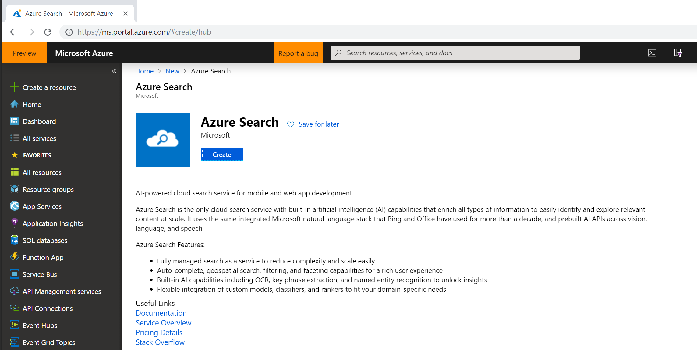
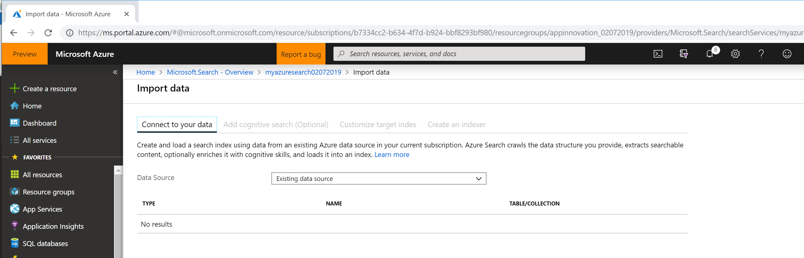
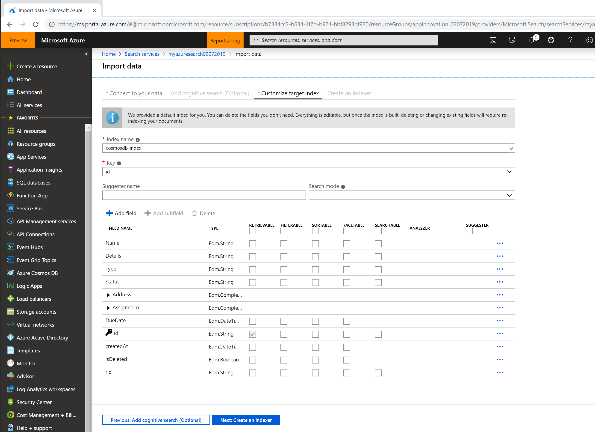

# Azure Search
Many applications use search as the primary interaction pattern for their customers who expect great relevance, suggestions, near-instantaneous responses, multiple languages, faceting and more. Azure Search makes it easy for you to add powerful and sophisticated search capabilities to your website or application. The integrated Microsoft natural language stack, also used in Bing and Office, has been improved over 16 years of development. Quickly tune search results and construct rich, fine-tuned ranking models to tie search results to business goals. Reliable throughput and storage give you fast search indexing and querying to support time-sensitive search scenarios.

We're going to add Azure Search to our project for searching the jobs. Right now we're using it in the most basic possible way, but we'll be expanding this later as the app grows in complexity. 

## Deploying Azure Search 
Click the "Create a Resource" in the top-left menu bar. You'll then be able to search for 'Azure Search'. 

Select Azure Search and click 'Create'. 

You'll have a few options for pricing, but for this demo, we should have plenty of capacity left over if we use the ***Free tier***. Hit the ***Review + Create*** button.  Once you've deployed Azure Search, go to the resource 

Once done you get to the Overview page.  

### Indexing our data
There are two ways to get data into Azure Search. The easiest is to make use of the automatic indexers. With the indexers, we're able to point Azure Search to our database and have it on a schedule look for new data. This can lead to situations where the database and search index are out-of-sync so be wary of using this approach in production. Instead, you should manage the search index manually using the lovely SDKs provided. 

For ease of use, we'll make use of the Indexers to get some data quickly into our index. 

To do this, click the "Import Data" button in the top toolbar. 

In the data source page, the source must be Cosmos DB, with the following specifications:

- Name is the name of the data source object. Once created, you can choose it for other workloads.

- Cosmos DB account should be the primary or secondary connection string from Cosmos DB, with an  AccountEndpoint and an AccountKey. The account determines whether data is cast as SQL API or Mongo DB API

- Database is an existing database from the account.

- Collection is a container of documents. Documents must exist in order for import to succeed.

- Query can be blank if you want all documents, otherwise you can input a query that selects a document subset.

We already have our database deployed, so we can select "Cosmos DB" and then click "Select an account". 

Once you've selected your Cosmos DB account, you should be able to use the drop-downs to select which database and collections you wish to import from. We'll be picking "Jobs". 
If the account does not appear in the list enter the following: ***AccountEndpoint=accountstring;AccountKey=accountkey***
Replace accountstring and accountkey with your Cosmos DB Connection String and Key.

Skip the Add Cognitive Search (optional) and go to Customise Target Index Section.

**Important Note**
The Index name must be set to "job-index", because it is referred to by name in the mobile application.

We need to configure what data we wish to send back down to the device with a search query as well as which properties we'll use to search. ***The Index is difficult to modify (apart from adding new fields) after we've created it, so its always worth double checking the values.***

More info here:
https://docs.microsoft.com/en-gb/rest/api/searchservice/create-index#bkmk_indexAttrib

**Important**
You need to create a _suggester_ called 'suggestions'. This is referred to by the _search_ API which we're writing. To do this, in the top section in the field 'Suggester name' box and enter 'suggestions' as its name. Then you also need to mark at least one field as being part of the suggester. We suggest(!) that the _Name_ and _Details_ fields are marked as such. (See image)

Also note that at the moment the Suggester details aren't visible in the index once you've created (this is a shortcoming of the current Azure portal).

Once you've completed this setup, click ***"Create an indexer"***. 

You can now set the frequenancy at which Azure Search will look for new data. I recommend for this demo setting it to be 5 minutes. We can do this by selecting "custom". 

We also want to track deletions, so go ahead and check the tickbox and select the 'isDeleted' item from the drop-down menu and set the marker value to "true". 

You're now ready to click "Submit" which will create the indexer and importer for you. 

Click on the "indexers" item within the overview blade. 

We can now run the indexer for the first time. Once its completed, navigate back to the Azure Search Overview and click on "Indexes". We can now confirm if the search service is working as expected. 

# Next Steps 
[Functions & Cognitive Services](.././07%20Functions%20and%20Cognitive%20Services)

